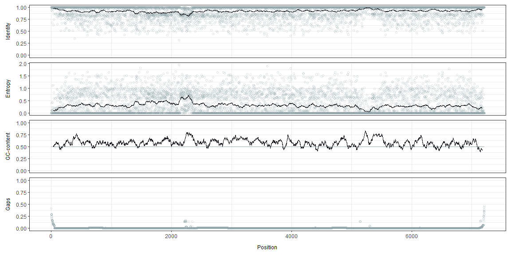
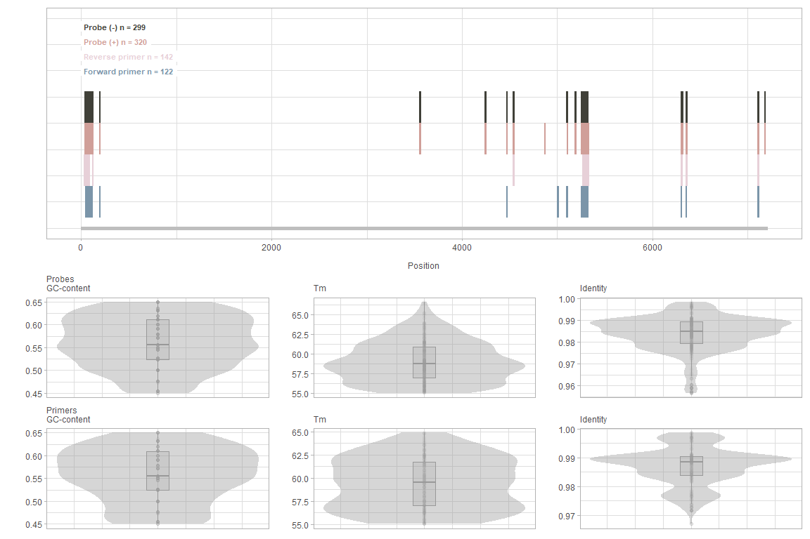
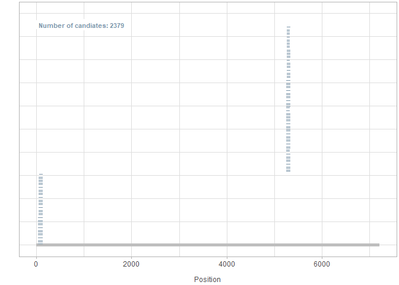

<!-- README.md is generated from README.Rmd. Please edit that file -->

<!-- badges: start --> [](https://github.com/sofpn/rprimer/actions)
<!-- badges: end -->

<!-- badges: start --> [](https://codecov.io/gh/sofpn/rprimer?branch=master)
<!-- badges: end -->

**att göra: \* validate objs, dokumentera och testa s4 klasserna  
\* snurra på x axlar plottar, (15 nov) \* installera, jmfr med
existerande (primer3, open primer) + skicka \* github release?**

## Installation

You can install rprimer from [GitHub](https://github.com/) with:

``` r
# install.packages("devtools")
devtools::install_github("sofpn/rprimer")
```

Initial setup for the code in this document:

``` r
# library(rprimer)
devtools::load_all(".")
library(magrittr) # Required for the pipe operator 
library(Biostrings) # Required to import alignment
```

## Overview

rprimer provides tools for designing (RT)-(q/dd)PCR assays from multiple
DNA sequence alignments. The design process is built on three functions:

  - `getConsensusProfile()`: returns an `RprimerProfile` object, which
    is used as input for;
  - `getOligos()`: returns an `RprimerOligo` object, which is used as
    input for;
  - `getAssays()`: returns an `RprimerAssay` object.

The `Rprimer`-classes are extensions of the `DataFrame` class from
S4Vectors, and behave in a similar manner as traditional data frames.

## Workflow

### Import data

The first step is to import an alignment with target sequences of
interest and, if preferred, mask positions with high gap frequency.
`readDNAMultipleAlignment()` and `maskGaps()` from Biostrings do the
work for this part.

``` r
infile <- system.file('extdata', 'example_alignment.txt', package = 'rprimer')

myAlignment <- infile %>%
  Biostrings::readDNAMultipleAlignment(., format = "fasta") %>%
  Biostrings::maskGaps(., min.fraction = 0.5, min.block.width = 1) 
```

### Step 1: `getConsensusProfile`

`getConsensusProfile()` takes a `Biostrings::DNAMultipleAlignment`
object as input and returns all the information needed for the
subsequent design process.

``` r
myConsensusProfile <- getConsensusProfile(myAlignment, iupacThreshold = 0.05)
```

Output:

| position |    a |    c |    g |    t | other | gaps | majority | identity | iupac | entropy |
| -------: | ---: | ---: | ---: | ---: | ----: | ---: | :------- | -------: | :---- | ------: |
|        1 | 0.00 | 0.00 | 0.59 | 0.00 |     0 | 0.41 | G        |     1.00 | G     |    0.00 |
|        2 | 0.00 | 0.00 | 0.71 | 0.00 |     0 | 0.29 | G        |     1.00 | G     |    0.00 |
|        3 | 0.00 | 0.71 | 0.00 | 0.00 |     0 | 0.29 | C        |     1.00 | C     |    0.00 |
|        4 | 0.71 | 0.00 | 0.00 | 0.00 |     0 | 0.29 | A        |     1.00 | A     |    0.00 |
|        5 | 0.00 | 0.00 | 0.70 | 0.01 |     0 | 0.29 | G        |     0.99 | G     |    0.11 |
|        6 | 0.71 | 0.00 | 0.00 | 0.00 |     0 | 0.29 | A        |     1.00 | A     |    0.00 |

The output can be visualized with `plotData()`, and specific regions can
be highlighted using the optional arguments `shadeFrom` and `shadeTo`.

``` r
plotData(myConsensusProfile, shadeFrom = 5000, shadeTo = 5500)
```



### Step 2: `getOligos`

`getOligos()` searches for oligos from an `RprimerProfile`-object. All
oligos are shown in both majority (without degenerate bases) and IUPAC
format (with degenerate bases). The oligos are designed from the
following constraints:

  - `lengthPrimer` Primer length, defaults to `18:22`
  - `maxGapFrequencyPrimer` Maximum gap frequency for primers, defaults
    to `0.1`
  - `maxDegeneracyPrimer` Maximum number of variants of each primer,
    defaults to `4`
  - `gcClampPrimer` If primers must have a GC-clamp, defaults to `TRUE`
  - `avoid3endRunsPrimer` If primers with more than two runs of the same
    nucleotide at the terminal 3’ end should be avoided, defaults to
    `TRUE`
  - `minEndIdentityPrimer` Optional. Minimum allowed identity at the 3’
    end (i.e. the last five bases). E.g., if set to `1`, only primers
    with complete target conservation at the 3’ end will be considered
  - `gcRangePrimer` GC-content-range for primers, defaults to
    `c(0.45, 0.55)`
  - `tmRangePrimer` Melting temperature (Tm) range for primers, defaults
    to `c(55, 65)`. Tm is calculated using the nearest-neighbor method.
    See `?rprimer::getOligos` for a detailed description and references
  - `concPrimer` Primer concentration in nM (for Tm calculation),
    defaults to `500`
  - `probe` If probes should be designed as well, defaults to `TRUE`
  - `lengthProbe` Probe length, defaults to `18:22`
  - `maxGapFrequencyProbe` Maximum gap frequency for probes, defaults to
    `0.1`
  - `maxDegeneracyProbe` Maximum number of variants of each probe,
    defaults to `4`
  - `avoid5endGProbe` If probes with a G at the terminal 5’ end should
    be avoided, defaults to `TRUE`
  - `gcRangeProbe` GC-content-range for probes, defaults to
    `c(0.45, 0.55)`
  - `tmRangeProbe` Melting temperature (Tm) range for probes, defaults
    to `c(55, 70)`
  - `concProbe` Probe concentration in nM (for Tm calculation), defaults
    to `250`
  - `concNa` Sodium ion concentration in the PCR reaction (for Tm
    calculation), defaults to `0.05` M (50 mM)
  - `showAllVariants` If sequence, GC-content and Tm should be presented
    for all variants of each oligo (in case of degenerate bases).`TRUE`
    (slower) or `FALSE` (faster), defaults to `TRUE`

<!-- end list -->

``` r
myOligos <- getOligos(myConsensusProfile,
                      lengthPrimer = 18:22,
                      maxGapFrequencyPrimer = 0.05,
                      maxDegeneracyPrimer = 2,
                      gcClampPrimer = TRUE,
                      avoid3EndRunsPrimer = TRUE,
                      minEndIdentityPrimer = 1,
                      gcRangePrimer = c(0.45, 0.65),
                      tmRangePrimer = c(55, 65),
                      concPrimer = 500,
                      probe = TRUE,
                      lengthProbe = 16:24,
                      maxGapFrequencyProbe = 0.05,
                      maxDegeneracyProbe = 4,
                      avoid5EndGProbe = TRUE, 
                      gcRangeProbe = c(0.45, 0.65),
                      tmRangeProbe = c(55, 70),
                      concProbe = 250,
                      concNa = 0.05,
                      showAllVariants = TRUE)
```

The oligo candidates can be visualized using `plotData()`:

``` r
plotData(myOligos)
```



### Step 3: `getAssays`

`getAssays()` finds pairs of forward and reverse primers and combines
them with probes (if selected). The design process is based on the
following constraints:

  - `length` Amplicon length, defaults to `65:120`
  - `maxTmDifferencePrimers` Maximum Tm difference between the two
    primers (absolute value, calculated for majority primers), defaults
    to `2`
  - `tmDifferencePrimersProbe` Acceptable Tm difference between the
    primers (average Tm of the primer pair) and probe, defaults to
    `c(0, 20)`. The Tm-difference is calculated by subtracting the Tm of
    the (majority) probe with the average Tm of the (majority) primer
    pair. A negative Tm-difference means that the Tm of the probe is
    lower than the average Tm of the primer pair

<!-- end list -->

``` r
myAssays <- getAssays(myOligos, 
                      length = 65:120,
                      maxTmDifferencePrimers = 2,
                      tmDifferencePrimersProbe = c(-2, 10))
```

The assay candidates can be visualized using `plotData()`:

``` r
plotData(myAssays)
```



## More information

Please see the package vingette for a more detailed description of
rprimer and its functionality.
