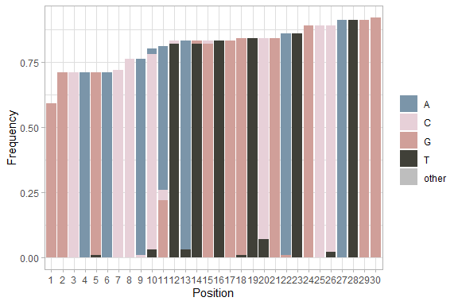

<!-- README.md is generated from README.Rmd. Please edit that file -->

<!-- badges: start --> [](https://github.com/sofpn/rprimer/actions)
<!-- badges: end -->

### Introduction

The purpose of rprimer is to design (RT)-(q/dd)PCR assays for highly
variable target sequences from multiple sequence alignments.

In this document, I demonstrate how to use the package by designing an
RT-qPCR assay for detection of hepatitis E virus.

### Package overview

The assay design workflow is based on the following functions:

  - `getAlignmentProfile()`
  - `getAlignmentProperties()`
  - `getOligos()`
  - `getAssays()`

### Installation

You can install the development version of rprimer from
[GitHub](https://github.com/) with:

``` r
# install.packages("devtools")
devtools::install_github("sofpn/rprimer")
```

Initial setup for the code in this example:

``` r
# library(rprimer)
devtools::load_all(".")
library(magrittr) ## Required for the pipe operator 
```

### To start

The first step is to import an alignment with target sequences of
interest and mask positions with high gap frequency. For this part, I
use previously existing functionality from the Biostrings-package.

The file “example\_alignment.txt” is provided with the rprimer package
and contains 100 hepatitis E virus sequences.

``` r
infile <- system.file('extdata', 'example_alignment.txt', package = 'rprimer')

myAlignment <- infile %>%
  Biostrings::readDNAMultipleAlignment(., format = "fasta") %>%
  Biostrings::maskGaps(., min.fraction = 0.5, min.block.width = 1) 
## Mask positions with at least 50 % gaps 
```

### Step 1: `getAlignmentProfile()`

`getAlignmentProfile()` is a wrapper around
`Biostrings::consensusMatrix()`. It takes a
`Biostrings::DNAMultipleAlignment` object as input and returns an
`RprimerProfile` object, which contains a numeric matrix that holds the
proportion of each nucleotide at each position in the alignment.

``` r
myAlignmentProfile <- getAlignmentProfile(myAlignment)
(myAlignmentProfile[ , 1:30]) ## View the first 30 bases 
#> class: RprimerProfile 
#> dim: 6 30 
#> metadata(0):
#> assays(1): x
#> rownames(6): A C ... - other
#> rowData names(0):
#> colnames(30): 1 2 ... 29 30
#> colData names(0):
```

The object can be visualized using `rpPlot()`. The `rc` option regulates
whether it should be displayed as a reverse complement or not.

``` r
rpPlot(myAlignmentProfile[, 1:30], rc = FALSE) ## Plot the first 30 bases 
```



### Step 2: `getAlignmentProperties()`

`getAlignmentProperties()` takes an `RprimerProfile`-object as input and
returns an `RprimerProperties`-object with information about majority
and IUPAC consensus base at each position, together with gap frequency,
nucleotide identity and Shannon entropy (a measurement of variability).
All nucleotides that occurs with a frequency higher than the
`iupacThreshold` will be included in the IUPAC consensus base.

``` r
myAlignmentProperties <- getAlignmentProperties(
  myAlignmentProfile, iupacThreshold = 0.05 
)
head(myAlignmentProperties)
#> # A tibble: 6 x 6
#>   Position Majority IUPAC  Gaps Identity Entropy
#>      <int> <chr>    <chr> <dbl>    <dbl>   <dbl>
#> 1        1 G        G     0.41      1       0   
#> 2        2 G        G     0.290     1       0   
#> 3        3 C        C     0.290     1       0   
#> 4        4 A        A     0.290     1       0   
#> 5        5 G        G     0.290     0.99    0.11
#> 6        6 A        A     0.290     1       0
```

The object can be visualised with `rpPlot()`.

### Step 3: `getOligos()`

`getOligos()` takes an `RprimerProperties` object as input and searches
for oligos based on the following constraints:

  - `maxGapFrequency` Maximum gap frequency, defaults to `0.1`.
  - `length` Oligo length, defaults to `18:22`.
  - `maxDegeneracy` Maximum number of degenerate variants of each oligo,
    defaults to `4`.
  - `gcClamp` If oligos must have a GC-clamp to be considered as valid
    (recommended for primers), defaults to `TRUE`.
  - `avoid3endRuns` If oligos with more than two runs of the same
    nucleotide at the terminal 3’ end should be excluded (recommended
    for primers), defaults to `TRUE`.
  - `avoid5endG` If oligos with a G at the terminal 5’ end should be
    avoided (recommended for probes), defaults to `FALSE`.
  - `minEndIdentity` Optional. Minimum allowed identity at the 3’ end
    (i.e. the last five bases). E.g., if set to `1`, only oligos with
    complete target conservation at the 3’ end will be considered.
  - `gcRange` GC-content-range, defaults to `c(0.45, 0.55)`.
  - `tmRange` Melting temperature (Tm) range, defaults to `c(50, 65)`.
    Tm is calculated using the nearest-neighbor method. See
    `?rprimer::getOligos` for a detailed description and references.
  - `concOligo` Oligo concentration (for Tm calculation), defaults to
    `5e-07` M (500 nM)
  - `concNa` Sodium ion concentration (for Tm calculation), defaults to
    `0.05` M (50 mM).
  - `showAllVariants` If sequence, GC-content and Tm should be presented
    for all variants of each oligo (in case of degenerate bases).`TRUE`
    (slower) or `FALSE` (faster), defaults to `TRUE`.

In addition, `get_oligos()` avoids:

  - Oligos with more than than three consecutive runs of the same
    dinucleotide (e.g. “TATATATA”)
  - Oligos with more than four consecutive runs of the same nucleotide
    (e.g. “AAAAA”)
  - Oligos that are duplicated (to prevent binding at several places on
    the genome)

Below, I want to design both primers and probes. I use somewhat
different settings for the two oligo types.

An error message will return if no oligos are found.

``` r
myPrimers <- getOligos(myAlignmentProperties,
                       length = 18:22,
                       maxGapFrequency = 0.05,
                       maxDegeneracy = 4,
                       gcClamp = TRUE,
                       avoid3EndRuns = TRUE,
                       avoid5EndG = FALSE,
                       minEndIdentity = 0.99,
                       gcRange = c(0.40, 0.60),
                       tmRange = c(50, 65),
                       showAllVariants = TRUE)

myProbes <-  getOligos(myAlignmentProperties,
                       length = 16:22,
                       maxGapFrequency = 0.05,
                       maxDegeneracy = 4,
                       gcClamp = FALSE,
                       avoid3EndRuns = FALSE,
                       avoid5EndG = TRUE,
                       minEndIdentity = NULL,
                       gcRange = c(0.40, 0.60),
                       tmRange = c(50, 75),
                       showAllVariants = TRUE)
```

### Step 4: `getAssays()`

`getAssays()` finds pairs of forward and reverse primers and combines
them with probes (if selected). It takes `RprimerOligo` objects as input
and returns an `RprimerAssay` object.

Assays are designed from the following constraints:

  - `length` Amplicon length, defaults to `65:120`.
  - `maxTmDifferencePrimers` Maximum Tm difference between the two
    primers (absolute value), defaults to `2`.
  - `tmDifferenceProbes` Acceptable Tm difference between the primers
    (average Tm of the primer pair) and probe, defaults to `c(0, 20)`.

Candidate assays are displayed in a tibble. An error message will return
if no assays are found.

``` r
myAssays <- getAssays(primers = myPrimers, 
                      probes = myProbes)
```

### Session info

``` r
sessionInfo()
#> R version 4.0.2 (2020-06-22)
#> Platform: x86_64-w64-mingw32/x64 (64-bit)
#> Running under: Windows 10 x64 (build 18362)
#> 
#> Matrix products: default
#> 
#> locale:
#> [1] LC_COLLATE=Swedish_Sweden.1252  LC_CTYPE=Swedish_Sweden.1252   
#> [3] LC_MONETARY=Swedish_Sweden.1252 LC_NUMERIC=C                   
#> [5] LC_TIME=Swedish_Sweden.1252    
#> 
#> attached base packages:
#> [1] stats     graphics  grDevices utils     datasets  methods   base     
#> 
#> other attached packages:
#> [1] magrittr_1.5   rprimer_0.99.0 testthat_2.3.2
#> 
#> loaded via a namespace (and not attached):
#>  [1] Rcpp_1.0.5                  lattice_0.20-41            
#>  [3] prettyunits_1.1.1           ps_1.3.4                   
#>  [5] Biostrings_2.57.2           utf8_1.1.4                 
#>  [7] assertthat_0.2.1            rprojroot_1.3-2            
#>  [9] digest_0.6.25               R6_2.4.1                   
#> [11] GenomeInfoDb_1.25.11        plyr_1.8.6                 
#> [13] backports_1.1.9             stats4_4.0.2               
#> [15] evaluate_0.14               ggplot2_3.3.2              
#> [17] pillar_1.4.6                zlibbioc_1.35.0            
#> [19] rlang_0.4.7                 rstudioapi_0.11            
#> [21] callr_3.4.4                 S4Vectors_0.27.12          
#> [23] Matrix_1.2-18               rmarkdown_2.3              
#> [25] labeling_0.3                desc_1.2.0                 
#> [27] devtools_2.3.1              stringr_1.4.0              
#> [29] RCurl_1.98-1.2              munsell_0.5.0              
#> [31] DelayedArray_0.15.8         compiler_4.0.2             
#> [33] xfun_0.17                   pkgconfig_2.0.3            
#> [35] BiocGenerics_0.35.4         pkgbuild_1.1.0             
#> [37] htmltools_0.5.0             tidyselect_1.1.0           
#> [39] SummarizedExperiment_1.19.6 tibble_3.0.3               
#> [41] GenomeInfoDbData_1.2.3      matrixStats_0.56.0         
#> [43] IRanges_2.23.10             fansi_0.4.1                
#> [45] crayon_1.3.4                dplyr_1.0.2                
#> [47] withr_2.2.0                 bitops_1.0-6               
#> [49] grid_4.0.2                  gtable_0.3.0               
#> [51] lifecycle_0.2.0             scales_1.1.1               
#> [53] cli_2.0.2                   stringi_1.5.3              
#> [55] farver_2.0.3                XVector_0.29.3             
#> [57] reshape2_1.4.4              fs_1.5.0                   
#> [59] remotes_2.2.0               ellipsis_0.3.1             
#> [61] generics_0.0.2              vctrs_0.3.4                
#> [63] tools_4.0.2                 Biobase_2.49.1             
#> [65] glue_1.4.2                  purrr_0.3.4                
#> [67] processx_3.4.4              pkgload_1.1.0              
#> [69] parallel_4.0.2              yaml_2.2.1                 
#> [71] colorspace_1.4-1            GenomicRanges_1.41.6       
#> [73] sessioninfo_1.1.1           memoise_1.1.0              
#> [75] knitr_1.29                  usethis_1.6.1
```
