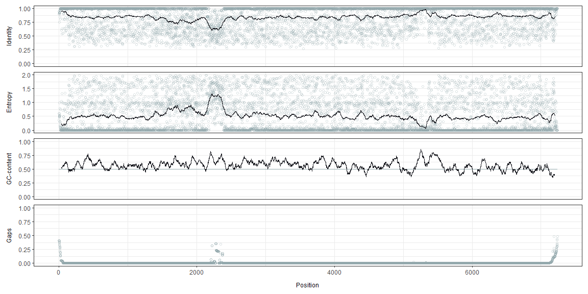
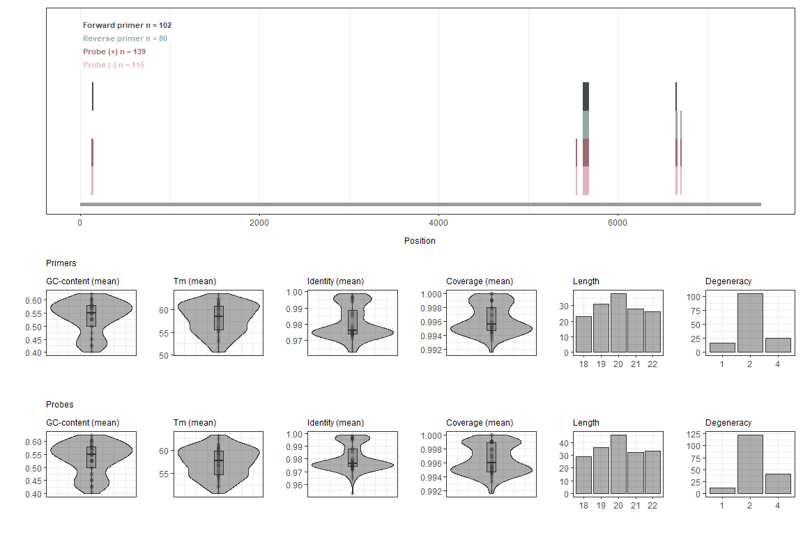
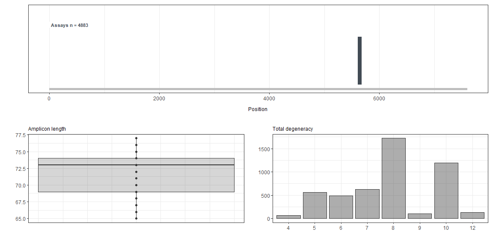
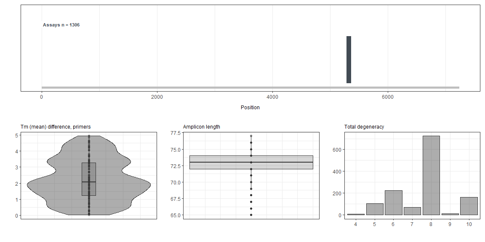

<!-- README.md is generated from README.Rmd. Please edit that file -->

<!-- badges: start --> <!-- badges: end -->

## Installation

rprimer can be installed from [GitHub](https://github.com/) with:

``` r
if (!requireNamespace("devtools", quietly = TRUE))
  install.packages("devtools")
devtools::install_github("sofpn/rprimer", auth_token = "85946c568a9f7f71285067bf58d28f25847ecbe0")
```

``` r
library(rprimer)
```

## Overview

rprimer provides tools for designing broadly reactive primers, probes
and (RT)-(q/d)PCR assays from a multiple DNA sequence alignment.

The package contains four functions:

  - `consensusProfile()`
  - `oligos()`
  - `assays()`
  - `plotData()`

## Workflow

### Import alignment

The first step is to import an alignment with target sequences of
interest and, if preferred, mask positions with e.g. high gap frequency.
`readDNAMultipleAlignment()` and `maskGaps()` from Biostrings do the
work for this part. The file “example\_alignment.txt” contains an
alignment of 200 hepatitis E virus sequences.

``` r
infile <- system.file("extdata", "example_alignment.txt", package = "rprimer")

myAlignment <- Biostrings::readDNAMultipleAlignment(infile, format = "fasta")
myAlignment <- Biostrings::maskGaps(myAlignment, 
                                    min.fraction = 0.5, 
                                    min.block.width = 1) 
```

### Step 1: `consensusProfile`

`consensusProfile()` takes a `Biostrings::DNAMultipleAlignment` as input
and returns all the information needed for the subsequent design
process.

``` r
myConsensusProfile <- consensusProfile(myAlignment, ambiguityThreshold = 0.05)
```

Results (first six rows):

| position |    a |    c |    g |    t | other | gaps | majority | identity | iupac | entropy | coverage |
| -------: | ---: | ---: | ---: | ---: | ----: | ---: | :------- | -------: | :---- | ------: | -------: |
|        1 | 0.00 | 0.00 | 0.56 | 0.02 |     0 | 0.41 | G        |     0.95 | G     |    0.35 |     0.95 |
|        2 | 0.01 | 0.54 | 0.01 | 0.04 |     0 | 0.41 | C        |     0.90 | Y     |    0.60 |     0.97 |
|        3 | 0.54 | 0.02 | 0.01 | 0.02 |     0 | 0.41 | A        |     0.92 | A     |    0.54 |     0.92 |
|        4 | 0.02 | 0.01 | 0.56 | 0.01 |     0 | 0.40 | G        |     0.93 | G     |    0.50 |     0.93 |
|        5 | 0.56 | 0.00 | 0.02 | 0.03 |     0 | 0.40 | A        |     0.93 | A     |    0.46 |     0.93 |
|        6 | 0.01 | 0.58 | 0.02 | 0.01 |     0 | 0.38 | C        |     0.93 | C     |    0.49 |     0.93 |

The results can be visualized with `plotData()`. You can either plot the
entire genome:

``` r
plotData(myConsensusProfile)
```



Or zoom into a specific region of interest:

``` r
roi <- myConsensusProfile[myConsensusProfile$position >= 5000 & myConsensusProfile$position <= 5500, ]
plotData(roi)
```


The nucleotide distribution can be shown, preferably within a short
range, by specifying `type = "nucleotide`:

``` r
roi2 <- myConsensusProfile[myConsensusProfile$position >= 150 & myConsensusProfile$position <= 170, ]
plotData(roi2, type = "nucleotide")
```



### Step 2: `oligos`

The next step is to design oligos. You can either use the default
settings as below, or adjust the design constraints (see the package
vignette or `?oligos` for more information).

``` r
myOligos <- oligos(myConsensusProfile)
```

Results (first six rows):

| type   | fwd   | rev   | start | end | length | iupacSequence        | iupacSequenceRc      | identity | coverage | degeneracy | gcContentMean | gcContentRange | tmMean | tmRange | sequence   | sequenceRc | gcContent  | tm         | method    | roiStart | roiEnd |
| :----- | :---- | :---- | ----: | --: | -----: | :------------------- | :------------------- | -------: | -------: | ---------: | ------------: | -------------: | -----: | ------: | :--------- | :--------- | :--------- | :--------- | :-------- | -------: | -----: |
| primer | FALSE | TRUE  |    26 |  43 |     18 | ATGGAGGCCCAYCAGTTY   | RAACTGRTGGGCCTCCAT   |     0.95 |        1 |          4 |          0.56 |           0.11 |  57.14 |    3.25 | ATGGAGGC…. | GAACTGGT…. | 0.611111…. | 58.74874…. | ambiguous |        1 |   7238 |
| primer | FALSE | TRUE  |    26 |  44 |     19 | ATGGAGGCCCAYCAGTTYA  | TRAACTGRTGGGCCTCCAT  |     0.95 |        1 |          4 |          0.53 |           0.11 |  57.74 |    5.24 | ATGGAGGC…. | TGAACTGG…. | 0.578947…. | 60.36049…. | ambiguous |        1 |   7238 |
| primer | FALSE | TRUE  |    26 |  45 |     20 | ATGGAGGCCCAYCAGTTYAT | ATRAACTGRTGGGCCTCCAT |     0.96 |        1 |          4 |          0.50 |           0.10 |  57.93 |    4.99 | ATGGAGGC…. | ATGAACTG…. | 0.55, 0….. | 60.42434…. | ambiguous |        1 |   7238 |
| probe  | TRUE  | FALSE |    26 |  43 |     18 | ATGGAGGCCCAYCAGTTY   | RAACTGRTGGGCCTCCAT   |     0.95 |        1 |          4 |          0.56 |           0.11 |  56.03 |    3.26 | ATGGAGGC…. | GAACTGGT…. | 0.611111…. | 57.64097…. | ambiguous |        1 |   7238 |
| probe  | TRUE  | TRUE  |    26 |  44 |     19 | ATGGAGGCCCAYCAGTTYA  | TRAACTGRTGGGCCTCCAT  |     0.95 |        1 |          4 |          0.53 |           0.11 |  56.68 |    5.23 | ATGGAGGC…. | TGAACTGG…. | 0.578947…. | 59.29114…. | ambiguous |        1 |   7238 |
| probe  | TRUE  | TRUE  |    26 |  45 |     20 | ATGGAGGCCCAYCAGTTYAT | ATRAACTGRTGGGCCTCCAT |     0.96 |        1 |          4 |          0.50 |           0.10 |  56.92 |    4.98 | ATGGAGGC…. | ATGAACTG…. | 0.55, 0….. | 59.40578…. | ambiguous |        1 |   7238 |

The results can be visualized using `plotData()`.

``` r
plotData(myOligos)
```



### Step 3: `assays`

`assays()` finds pairs of forward and reverse primers and combines them
with probes, if probes are present in the dataset. You can either use
the default settings as below, or adjust the design constraints (see the
package vignette or `?assays` for more information).

``` r
myAssays <- assays(myOligos)
```

Results (first six rows):

| start |  end | ampliconLength | tmDifferencePrimer | tmDifferencePrimerProbe | totalDegeneracy | startFwd | endFwd | lengthFwd | iupacSequenceFwd     | identityFwd | coverageFwd | degeneracyFwd | gcContentMeanFwd | gcContentRangeFwd | tmMeanFwd | tmRangeFwd | sequenceFwd | gcContentFwd | tmFwd      | methodFwd | startRev | endRev | lengthRev | iupacSequenceRev      | identityRev | coverageRev | degeneracyRev | gcContentMeanRev | gcContentRangeRev | tmMeanRev | tmRangeRev | sequenceRev | gcContentRev | tmRev      | methodRev | plusPr | minusPr | startPr | endPr | lengthPr | iupacSequencePr        | iupacSequenceRcPr      | identityPr | coveragePr | degeneracyPr | gcContentMeanPr | gcContentRangePr | tmMeanPr | tmRangePr | sequencePr | sequenceRcPr | gcContentPr | tmPr       | methodPr  | roiStart | roiEnd |
| ----: | ---: | -------------: | -----------------: | ----------------------: | --------------: | -------: | -----: | --------: | :------------------- | ----------: | ----------: | ------------: | ---------------: | ----------------: | --------: | ---------: | :---------- | :----------- | :--------- | :-------- | -------: | -----: | --------: | :-------------------- | ----------: | ----------: | ------------: | ---------------: | ----------------: | --------: | ---------: | :---------- | :----------- | :--------- | :-------- | :----- | :------ | ------: | ----: | -------: | :--------------------- | :--------------------- | ---------: | ---------: | -----------: | --------------: | ---------------: | -------: | --------: | :--------- | :----------- | :---------- | :--------- | :-------- | -------: | -----: |
|  5286 | 5361 |             76 |               4.64 |                    0.24 |               6 |     5286 |   5305 |        20 | GGCRGTGGTTTCTGGGGTGA |        0.98 |           1 |             2 |             0.62 |              0.05 |     62.84 |       2.51 | GGCAGTGG….  | 0.6, 0.65    | 61.57995…. | ambiguous |     5342 |   5361 |        20 | CRAAGGGGTTGGTTGGATGA  |        0.98 |           1 |             2 |             0.52 |              0.05 |     58.19 |       1.99 | CGAAGGGG….  | 0.55, 0.5    | 59.18721…. | ambiguous | TRUE   | TRUE    |    5307 |  5328 |       22 | MGGGTTGATTCTCAGCCCTTCG | CGAAGGGCTGAGAATCAACCCK |       0.98 |          1 |            2 |            0.57 |             0.05 |    60.75 |      1.22 | AGGGTTGA…. | CGAAGGGC….   | 0.545454….  | 60.14594…. | ambiguous |        1 |   7238 |
|  5286 | 5361 |             76 |               4.64 |                    0.01 |               8 |     5286 |   5305 |        20 | GGCRGTGGTTTCTGGGGTGA |        0.98 |           1 |             2 |             0.62 |              0.05 |     62.84 |       2.51 | GGCAGTGG….  | 0.6, 0.65    | 61.57995…. | ambiguous |     5342 |   5361 |        20 | CRAAGGGGTTGGTTGGATGA  |        0.98 |           1 |             2 |             0.52 |              0.05 |     58.19 |       1.99 | CGAAGGGG….  | 0.55, 0.5    | 59.18721…. | ambiguous | TRUE   | FALSE   |    5314 |  5334 |       21 | ATTCTCAGCCCTTCGCMMTCC  | GGAKKGCGAAGGGCTGAGAAT  |       0.98 |          1 |            4 |            0.57 |             0.10 |    60.53 |      3.49 | ATTCTCAG…. | GGATTGCG….   | 0.523809….  | 58.78181…. | ambiguous |        1 |   7238 |
|  5286 | 5361 |             76 |               4.64 |                    1.96 |               8 |     5286 |   5305 |        20 | GGCRGTGGTTTCTGGGGTGA |        0.98 |           1 |             2 |             0.62 |              0.05 |     62.84 |       2.51 | GGCAGTGG….  | 0.6, 0.65    | 61.57995…. | ambiguous |     5342 |   5361 |        20 | CRAAGGGGTTGGTTGGATGA  |        0.98 |           1 |             2 |             0.52 |              0.05 |     58.19 |       1.99 | CGAAGGGG….  | 0.55, 0.5    | 59.18721…. | ambiguous | TRUE   | FALSE   |    5314 |  5335 |       22 | ATTCTCAGCCCTTCGCMMTCCC | GGGAKKGCGAAGGGCTGAGAAT |       0.98 |          1 |            4 |            0.59 |             0.09 |    62.47 |      3.36 | ATTCTCAG…. | GGGATTGC….   | 0.545454….  | 60.80008…. | ambiguous |        1 |   7238 |
|  5286 | 5361 |             76 |               4.64 |                    2.54 |               8 |     5286 |   5305 |        20 | GGCRGTGGTTTCTGGGGTGA |        0.98 |           1 |             2 |             0.62 |              0.05 |     62.84 |       2.51 | GGCAGTGG….  | 0.6, 0.65    | 61.57995…. | ambiguous |     5342 |   5361 |        20 | CRAAGGGGTTGGTTGGATGA  |        0.98 |           1 |             2 |             0.52 |              0.05 |     58.19 |       1.99 | CGAAGGGG….  | 0.55, 0.5    | 59.18721…. | ambiguous | TRUE   | TRUE    |    5318 |  5339 |       22 | TCAGCCCTTCGCMMTCCCCTAT | ATAGGGGAKKGCGAAGGGCTGA |       0.98 |          1 |            4 |            0.59 |             0.09 |    63.05 |      3.43 | TCAGCCCT…. | ATAGGGGA….   | 0.545454….  | 61.34426…. | ambiguous |        1 |   7238 |
|  5286 | 5361 |             76 |               4.64 |                    0.63 |               8 |     5286 |   5305 |        20 | GGCRGTGGTTTCTGGGGTGA |        0.98 |           1 |             2 |             0.62 |              0.05 |     62.84 |       2.51 | GGCAGTGG….  | 0.6, 0.65    | 61.57995…. | ambiguous |     5342 |   5361 |        20 | CRAAGGGGTTGGTTGGATGA  |        0.98 |           1 |             2 |             0.52 |              0.05 |     58.19 |       1.99 | CGAAGGGG….  | 0.55, 0.5    | 59.18721…. | ambiguous | TRUE   | TRUE    |    5320 |  5339 |       20 | AGCCCTTCGCMMTCCCCTAT   | ATAGGGGAKKGCGAAGGGCT   |       0.98 |          1 |            4 |            0.60 |             0.10 |    61.14 |      3.77 | AGCCCTTC…. | ATAGGGGA….   | 0.55, 0…..  | 59.26267…. | ambiguous |        1 |   7238 |
|  5286 | 5362 |             77 |               1.85 |                    0.56 |               8 |     5286 |   5305 |        20 | GGCRGTGGTTTCTGGGGTGA |        0.98 |           1 |             2 |             0.62 |              0.05 |     62.84 |       2.51 | GGCAGTGG….  | 0.6, 0.65    | 61.57995…. | ambiguous |     5342 |   5362 |        21 | GCRAAGGGGTTGGTTGGATGA |        0.98 |           1 |             2 |             0.55 |              0.05 |     60.99 |       1.85 | GCGAAGGG….  | 0.571428….   | 61.91509…. | ambiguous | TRUE   | FALSE   |    5314 |  5335 |       22 | ATTCTCAGCCCTTCGCMMTCCC | GGGAKKGCGAAGGGCTGAGAAT |       0.98 |          1 |            4 |            0.59 |             0.09 |    62.47 |      3.36 | ATTCTCAG…. | GGGATTGC….   | 0.545454….  | 60.80008…. | ambiguous |        1 |   7238 |

The assays can be visualized using `plotData()`:

``` r
plotData(myAssays)
```



## More information

The package vignette contains more information. It is loaded by
`browseVignettes("rprimer")`.
