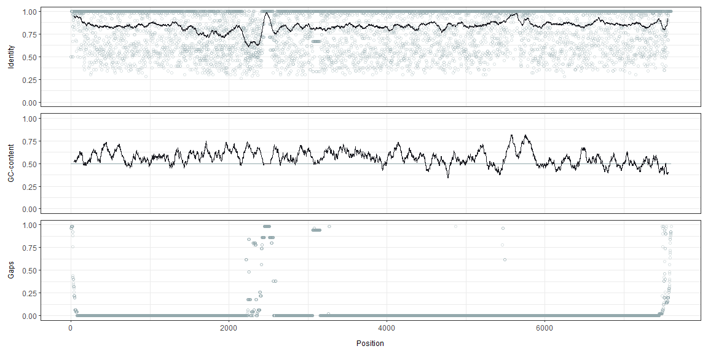

<!-- README.md is generated from README.Rmd. Please edit that file -->

<!-- badges: start --> [](https://github.com/sofpn/rprimer/actions)
<!-- badges: end -->

**to do: validate objs, kolla documentation/alla defaults, write tests,
skriv vingette, new test files, installera, jmfr med existerande,
skicka**

### Installation

You can install rprimer from [GitHub](https://github.com/) with:

``` r
# install.packages("devtools")
devtools::install_github("sofpn/rprimer")
```

Initial setup for the code in this document:

``` r
# library(rprimer)
devtools::load_all(".")
library(magrittr) # Required for the pipe operator 
library(Biostrings) # Required to import alignment
```

### Overview

rprimer provides tools for designing (RT)-(q/dd)PCR assays from multiple
DNA sequence alignments. The design process is built on three functions:

  - `getConsensusProfile()`: returns an `RprimerProfile` object, which
    is used as input for;
  - `getOligos()`: returns an `RprimerOligo` object, which is used as
    input for;
  - `getAssays()`: returns an `RprimerAssay` object.

The `Rprimer`-classes are extensions of the `DataFrame` class from
S4Vectors, and behave in a similar manner as traditional data frames,
and can be coerced to such by using `as.data.frame()`.

### Import data

The first step is to import an alignment with target sequences of
interest and, if preferred, mask positions with high gap frequency.
`readDNAMultipleAlignment()` and `maskGaps()` from Biostrings do the
work for this part.

Here, I want to design an RT-(q/d)PCR assay for detection of hepatitis E
virus, which is a highly variable RNA virus. The file
“example\_alignment.txt” is provided and contains 100 hepatitis E
virus sequences.

``` r
infile <- system.file('extdata', 'example_alignment.txt', package = 'rprimer')

myAlignment <- infile %>%
  Biostrings::readDNAMultipleAlignment(., format = "fasta") %>%
  Biostrings::maskGaps(., min.fraction = 0.5, min.block.width = 1) 
```

### Step 1: `getConsensusProfile`

`getConsensusProfile()` takes a `Biostrings::DNAMultipleAlignment`
object as input and returns all the information needed for the
subsequent design process. Masked positions are excluded.

``` r
myConsensusProfile <- getConsensusProfile(myAlignment, iupacThreshold = 0.05)
```

Output:

| position |    a |    c |    g |    t | other | gaps | majority | identity | iupac | entropy |
| -------: | ---: | ---: | ---: | ---: | ----: | ---: | :------- | -------: | :---- | ------: |
|        1 | 0.00 | 0.00 | 0.59 | 0.00 |     0 | 0.41 | G        |     1.00 | G     |    0.00 |
|        2 | 0.00 | 0.00 | 0.71 | 0.00 |     0 | 0.29 | G        |     1.00 | G     |    0.00 |
|        3 | 0.00 | 0.71 | 0.00 | 0.00 |     0 | 0.29 | C        |     1.00 | C     |    0.00 |
|        4 | 0.71 | 0.00 | 0.00 | 0.00 |     0 | 0.29 | A        |     1.00 | A     |    0.00 |
|        5 | 0.00 | 0.00 | 0.70 | 0.01 |     0 | 0.29 | G        |     0.99 | G     |    0.11 |
|        6 | 0.71 | 0.00 | 0.00 | 0.00 |     0 | 0.29 | A        |     1.00 | A     |    0.00 |

Some comments on the data:

  - Majority refers to the majority consensus sequence, which is the
    most frequently occurring base. Identity is the proportion of that
    base when gaps and other bases than A, C, G and T are not taken into
    account.

  - The IUPAC consensus sequence includes wobble bases according to the
    IUPAC-nomenclature. It includes all DNA bases (A, C, G, T) that
    occurs with a frequency higher than the stated `iupacThreshold`.
    **The iupac treshold has implications for downstream oligo design.**

  - Entropy refers to Shannon entropy, which is a measurement of
    variability. A value of zero indicate no variability and a high
    value indicate high variability. Gaps and other bases than A, C, G
    and T are not included in this calculation.

The target genome can be visualized with `plotData()`, and specific
regions can be highlighted using the optional arguments `shadeFrom` and
`shadeTo`. We can see that the most conserved region of the hepatitis E
virus genome is between position 5000-5500:

``` r
plotData(myConsensusProfile, shadeFrom = 5000, shadeTo = 5500)
```



The black lines represent centered running averages and the blue dots
represent the value at each position.

It is also possible to inspect the nucleotide distribution with
`plotNucleotides()`. Here, `rc` regulates whether the sequence should be
displayed as a reverse complement or not.

``` r
## Plot the first 30 bases 
plotNucleotides(myConsensusProfile[1:30, ], rc = FALSE) 
```


### Step 2: `getOligos`

`getOligos()` searches for oligos from an `RprimerProfile`-object. All
oligos are shown in both majority and IUPAC format. The oligos are
designed from the following constraints:

  - `lengthPrimer` Primer length, defaults to `18:22`.
  - `maxGapFrequencyPrimer` Maximum gap frequency for primers, defaults
    to `0.1`.
  - `maxDegeneracyPrimer` Maximum number of degenerate variants of each
    primer, defaults to `4`.
  - `gcClampPrimer` If primers must have a GC-clamp, defaults to `TRUE`.
  - `avoid3endRunsPrimer` If primers with more than two runs of the same
    nucleotide at the terminal 3’ end should be avoided (recommended for
    primers), defaults to `TRUE`.
  - `minEndIdentityPrimer` Optional. Minimum allowed identity at the 3’
    end (i.e. the last five bases). E.g., if set to `1`, only primers
    with complete target conservation at the 3’ end will be considered.
  - `gcRangePrimer` GC-content-range for primers, defaults to
    `c(0.45, 0.55)`.
  - `tmRangePrimer` Melting temperature (Tm) range for primers, defaults
    to `c(55, 65)`. Tm is calculated using the nearest-neighbor method.
    See `?rprimer::getOligos` for a detailed description and references.
  - `concPrimer` Primer concentration in nM (for Tm calculation),
    defaults to `500`.
  - `probe` If probes should be designed as well, defaults to `TRUE`.
  - `lengthProbe` Probe length, defaults to `18:22`.
  - `maxGapFrequencyProbe` Maximum gap frequency for probes, defaults to
    `0.1`.
  - `maxDegeneracyProbe` Maximum number of degenerate variants of each
    probe, defaults to `4`.
  - `avoid5endGProbe` If probes with a G at the terminal 5’ end should
    be avoided, defaults to `TRUE`.
  - `gcRangeProbe` GC-content-range for probes, defaults to
    `c(0.45, 0.55)`.
  - `tmRangeProbe` Melting temperature (Tm) range for probes, defaults
    to `c(55, 70)`.
  - `concProbe` Probe concentration in nM (for Tm calculation), defaults
    to `250`.
  - `concNa` Sodium ion concentration in the PCR reaction (for Tm
    calculation), defaults to `0.05` M (50 mM).
  - `showAllVariants` If sequence, GC-content and Tm should be presented
    for all variants of each oligo (in case of degenerate bases).`TRUE`
    (slower) or `FALSE` (faster), defaults to `TRUE`.

In addition, `getOligos()` avoids:

  - Majority oligos with more than than three consecutive runs of the
    same dinucleotide (e.g. “TATATATA”)
  - Majority oligos with more than four consecutive runs of the same
    nucleotide (e.g. “AAAAA”)
  - Majority oligos that are duplicated (to prevent binding at several
    places on the genome)

A warning message will return if no oligos are found.

Below, I design both primers and probes.

``` r
myOligos <- getOligos(myConsensusProfile,
                      lengthPrimer = 18:22,
                      maxGapFrequencyPrimer = 0.1,
                      maxDegeneracyPrimer = 4,
                      gcClampPrimer = TRUE,
                      avoid3EndRunsPrimer = TRUE,
                      minEndIdentityPrimer = 0.98,
                      gcRangePrimer = c(0.45, 0.65),
                      tmRangePrimer = c(55, 65),
                      concPrimer = 500,
                      probe = TRUE,
                      lengthProbe = 18:22,
                      maxGapFrequencyProbe = 0.1,
                      maxDegeneracyProbe = 4,
                      avoid5EndGProbe = TRUE, 
                      gcRangeProbe = c(0.45, 0.65),
                      tmRangeProbe = c(55, 70),
                      concProbe = 250,
                      concNa = 0.05,
                      showAllVariants = TRUE)
```

The object contains many columns, so the most sensible way to inspect it
is by using `View(as.data.frame(myOligos))`, if you are using RStudio.
All oligo candidates can be visualized using `plotData()`:

``` r
plotData(myOligos)
```


It is also possible, by subsetting, to select oligos targeting a
specific region:

``` r
plotData(myOligos[myOligos$start > 5000 & myOligos$end < 6000, ])
```


### Step 3: `getAssays`

`getAssays()` finds pairs of forward and reverse primers and combines
them with probes (if selected), based on the following constraints:

  - `length` Amplicon length, defaults to `65:120`.
  - `maxTmDifferencePrimers` Maximum Tm difference between the two
    primers (absolute value, calculated for majority primers), defaults
    to `2`.
  - `tmDifferencePrimersProbe` Acceptable Tm difference between the
    primers (average Tm of the primer pair) and probe, defaults to
    `c(0, 20)`. The Tm-difference is calculated by subtracting the Tm of
    the probe with the average Tm of the (majority) primer pair. A
    negative Tm-difference means that the Tm of the probe is lower than
    the average Tm of the primer pair.

An error message will return if no assays are found.

``` r
myAssays <- getAssays(myOligos, 
                      length = 65:120,
                      maxTmDifferencePrimers = 2,
                      tmDifferencePrimersProbe = c(-2, 10))
```

Again, the object contains many columns, so the most sensible way to
inspect it is by using `View(as.data.frame(myAssays))`, if you are using
RStudio. The assays can also be visualized using `plotData()`:

``` r
plotData(myAssays)
```


### Session info

``` r
sessionInfo()
#> R version 4.0.2 (2020-06-22)
#> Platform: x86_64-w64-mingw32/x64 (64-bit)
#> Running under: Windows 10 x64 (build 18362)
#> 
#> Matrix products: default
#> 
#> locale:
#> [1] LC_COLLATE=Swedish_Sweden.1252  LC_CTYPE=Swedish_Sweden.1252   
#> [3] LC_MONETARY=Swedish_Sweden.1252 LC_NUMERIC=C                   
#> [5] LC_TIME=Swedish_Sweden.1252    
#> 
#> attached base packages:
#> [1] stats4    parallel  stats     graphics  grDevices utils     datasets 
#> [8] methods   base     
#> 
#> other attached packages:
#> [1] Biostrings_2.57.2   XVector_0.29.3      IRanges_2.23.10    
#> [4] S4Vectors_0.27.12   BiocGenerics_0.35.4 magrittr_1.5       
#> [7] rprimer_0.99.0      testthat_2.3.2     
#> 
#> loaded via a namespace (and not attached):
#>  [1] tidyselect_1.1.0  xfun_0.17         remotes_2.2.0     reshape2_1.4.4   
#>  [5] purrr_0.3.4       colorspace_1.4-1  vctrs_0.3.4       generics_0.0.2   
#>  [9] usethis_1.6.1     htmltools_0.5.0   yaml_2.2.1        rlang_0.4.7      
#> [13] pkgbuild_1.1.0    pillar_1.4.6      glue_1.4.2        withr_2.2.0      
#> [17] sessioninfo_1.1.1 plyr_1.8.6        lifecycle_0.2.0   stringr_1.4.0    
#> [21] zlibbioc_1.35.0   munsell_0.5.0     gtable_0.3.0      devtools_2.3.1   
#> [25] memoise_1.1.0     evaluate_0.14     labeling_0.3      knitr_1.29       
#> [29] callr_3.4.4       ps_1.3.4          fansi_0.4.1       highr_0.8        
#> [33] Rcpp_1.0.5        backports_1.1.9   scales_1.1.1      desc_1.2.0       
#> [37] pkgload_1.1.0     farver_2.0.3      fs_1.5.0          ggplot2_3.3.2    
#> [41] digest_0.6.25     stringi_1.5.3     processx_3.4.4    dplyr_1.0.2      
#> [45] rprojroot_1.3-2   grid_4.0.2        cli_2.0.2         tools_4.0.2      
#> [49] patchwork_1.0.1   tibble_3.0.3      crayon_1.3.4      pkgconfig_2.0.3  
#> [53] ellipsis_0.3.1    prettyunits_1.1.1 assertthat_0.2.1  rmarkdown_2.3    
#> [57] rstudioapi_0.11   R6_2.4.1          compiler_4.0.2
```
