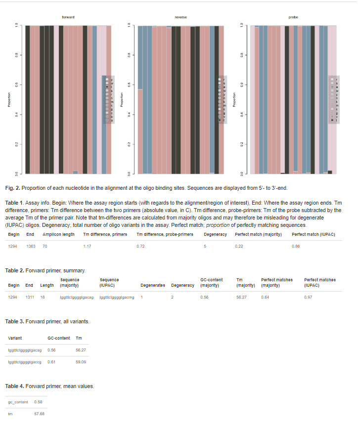
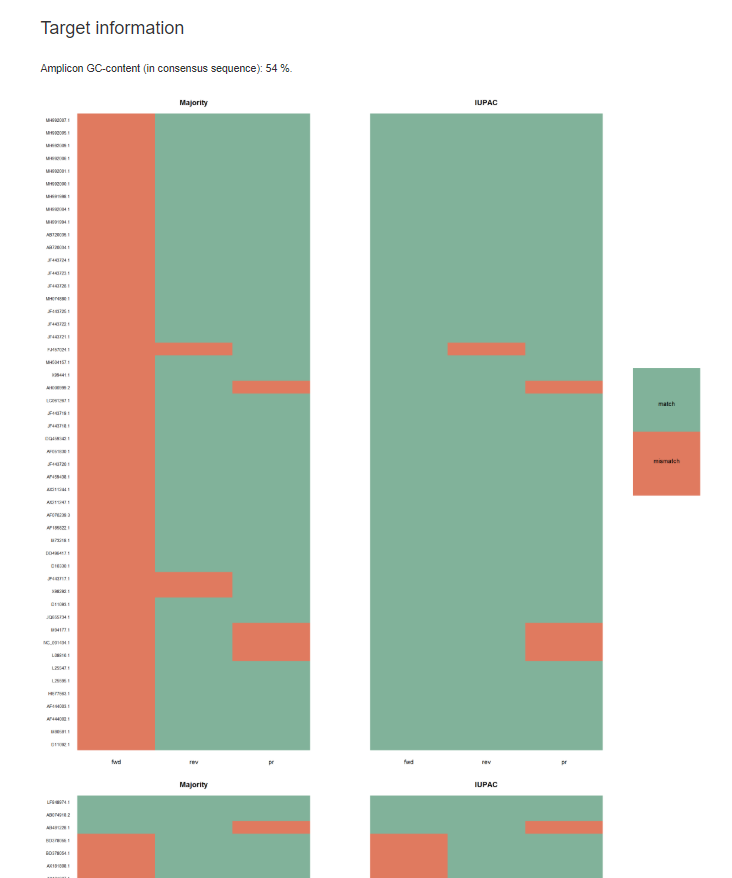

```{r, include = FALSE}
knitr::opts_chunk$set(
  collapse = TRUE,
  comment = "#>"
)
```

```{r setup, message = FALSE, warning = FALSE}
#library(rprimer)
devtools::load_all(".")
library(magrittr)
```

## Introduction 

There are several factors to take into account when designing primers, probes and PCR-assays, for instance:  

* GC content
* Melting temperature
* Sequence conservation 
* ....

The purpose of rprimer is to automate primer, probe and PCR assay design as much as possible. 

In this document, I demonstrate how to use rprimer by designing a real-time RT-PCR assay for detection of hepatitis E virus (HEV), which is a highly variable RNA virus and a common foodborne pathogen. 

## Installation

Install rprimer by calling: 

```{r}
# if (!requireNamespace("devtools", quietly = TRUE)) {
#    install.packages("devtools")
# }
# devtools::install_github("sofpn/rprimer")

# library(rprimer)
```

### Step 1: Import alignment 
Prepare a .txt-file with an alignment of the sequences of interest (in fasta-format), and import it using `read_fasta_alignment()`. In this example, I use an alignment with 100 HEV sequences that I have collected from GenBank, which is provided with the package. 

```{r}
infile <- system.file('extdata', 'example_alignment.txt', package = 'rprimer')
my_alignment <- read_fasta_alignment(infile)
```

From here, it is possible to either proceed directly to Step 2, or to process the alignment using `remove_gaps()` and/or `select_roi()`:

* `remove_gaps()` removes positions with a gap proportion higher than the stated `threshold` (the default is 0.5, i.e. 50 %). 

* `select_roi()` selects a region of interest (ROI) within the alignment. 

```{r}
my_alignment <- remove_gaps(my_alignment, threshold = 0.5)  %>%
  select_roi(., from = 4000, to = 6000) 
```

The output can be visualized with `rp_plot()`, where each sequence is represented as a horizontal line. 

```{r, fig.width=6, fig.height=6, fig.align='center'}
# For brevity, I select to plot only the first 30 sequences
rp_plot(my_alignment[1:30]) 
```

### Step 2: Get the sequence profile 
`sequence_profile()` takes an alignment as input and returns a matrix with the proportion of each nucleotide at each position in the alignment. 

```{r}
my_sequence_profile <- sequence_profile(my_alignment)

# The first 6 positions of the sequence profile
my_sequence_profile[, 1:6]
```

The sequence profile can be visualized with `rp_plot()`. A specific region can be selected with `from` and `to`. The `rc` option regulates whether the sequence should be displayed as a reverse complement or not (the default is `FALSE`).

```{r, fig.width=6, fig.height=6, fig.align='center'}
# The first 30 bases of the sequence profile  
rp_plot(my_sequence_profile, from = 1, to = 30, rc = FALSE) 
```

### Step 3: Get sequence properties 
`sequence_properties()` takes a sequence profile as input and returns a tibble (a data frame) with the following sequence properties: 

* *Majority*. The majority consensus sequence (the most frequently occurring nucleotide). 

* *Iupac*. The IUPAC-consensus sequence, which includes wobble bases according to the IUPAC-nomenclature. All nucleotides with a proportion higher than or equal to the  `iupac_threshold` will be included in the IUPAC-consensus sequence.  

* *Gaps*. The proportion of gaps.  

* *Identity*. The proportion of the most frequently occurring base.

* *Entropy*. The Shannon entropy, which is a measurement of variability. A value of zero indicate no variability and a high value indicate high variability. 

```{r}
my_sequence_properties <- sequence_properties(my_sequence_profile, iupac_threshold = 0.1)

str(my_sequence_properties)
```
Again, the output can be visualised with `rp_plot()`. Here, vertical bars represent the value at each position. The black bars in the two uppermost figures represent values of 1 and 0, respectively (i.e. positions with complete conservation). The horizontal lines represent centered running averages. 

```{r,fig.width=6, fig.height=6, fig.align='center'}
rp_plot(my_sequence_properties)
```
<br>
You can also select a region to have a closer look, for instance: 

```{r,fig.width=6, fig.height=6, fig.align='center'}
rp_plot(my_sequence_properties[200:500, ]) # Select position 300-500
```

### Step 4: Find primers 
`get_oligos()` takes sequence properties as input and searches for oligos that fulfill the following criteria: 

* `max_gap_frequency` Maximum allowed gap frequency. The default is 0.1, which means that only positions with a  gap frequency of <=0.1 will be considered.

* `length` Oligo length. The default is 18-22.

* `max_degenerates` The maximum number of degenerate positions in each oligo. The default is 2. 

* `max_degeneracy` The maximum number of degenerate variants of each oligo. The default is 4. 

* `avoid_3end_ta` If oligos with a T or an A at the 3' end should be avoided (recommended for primers to enhance specificity). The default is `TRUE`.

* `avoid_3end_runs` If oligos with more than two runs of the same nucleotide at the 3' end should be excluded (recommended for primers to avoid mispriming). The default is `TRUE`.

* `avoid_gc_rich_3end` If oligos with more than three G or C within the last five bases of the 3' end should be excluded (recommended for primers to avoid mispriming). The default is `TRUE`.

* `avoid_5end_g` If oligos with a G at the 5' end should be avoided (recommended for probes). The default is `FALSE`.

* `gc_range` GC-content-range (proportion, not %). The default is 0.45-0.55. 

* `tm_range` melting temperature (Tm) range. The default is 48-65 degrees Celcius. Tm is calculated using the nearest-neigbour method. See `?get_oligos` for a detailed description and references. 

* `conc_oligo` Oligo concentration (for Tm calculation). The default is 5e-07 M (500 nM).

* `conc_na` Sodium ion concentration (for Tm calculation). The default is 0.05 M (50 mM).

In addition, `get_oligos()` avoids oligos:

* With more than than three consecutive runs of the same dinucleotide (e.g. "TATATATA")

* With more than four consecutive runs of the same nucleotide (e.g. "AAAAA")

* That are duplicated (to prevent binding at several places on the genome)

Candidate oligos are displayed in a tibble. Oligo sequences are displayed in both majority and IUPAC format, and as reverse complements (rc). `NA` means that the oligo was excluded due to e.g. a terminal A or T (if `avoid_3end_ta = TRUE`). An error message will return if no oligos are found. 

I found 95 primers in my example. Most of them are located around position 1300, which is the most conserved region in my ROI. I only allowed one degenerate base in each primer, and no more than two variants of each primer. More primers can be found by increasing `max_degenerates` and `max_degeneracy`, or by increasing the `iupac_threshold` in the `sequence_properties()` function. 

**present match matrices separately**

```{r}
my_primers <- get_oligos(
  my_sequence_properties,
  target = my_alignment,
  max_gap_frequency = 0.05,
  length = 18:22,
  max_degenerates = 1,
  max_degeneracy = 2,
  avoid_3end_ta = TRUE,
  avoid_3end_runs = TRUE,
  avoid_gc_rich_3end = TRUE,
  avoid_5end_g = FALSE,
  gc_range = c(0.45, 0.60),
  tm_range = c(55, 70),
  conc_oligo = 5e-07,
  conc_na = 0.05
)

str(my_primers[, -ncol(my_primers)])
```

### Step 5: Get assays 
`get_assays()` finds pairs of forward and reverse primers that fulfil the following criteria:  

* `length` Amplicon length. The default is 65-120.

* `max_tm_difference` The maximum Tm difference between the two primers (absolute value, in C). The default is 1. Note that Tm-difference is calculated from the majority oligos, and may thus be misleading for degenerate (IUPAC) oligos.

Candidate assays are displayed in a tibble (see below). An error message will return if no assays are found. Three different combinations of forward and reverse primer were found in this example. `total_degeneracy` is the sum of the number of variants of the forward primer and reverse primer. 

The output looks a little messy (with many columns). **The last column, "match_matrix" contains a matrix for each assay with match information.** 

**describe perfect match matrices, and pm percentages**
**present less ugly output**

```{r}
my_assays <- get_assays(my_primers, length = 60:90, max_tm_difference = 2) 

str(my_assays[ , -ncol(my_assays)])
```

### Step 6: Add probes 
Probes can be generated with `get_oligos()`, and added to assays with `add_probes()`. 
Here, `tm_difference` is the acceptable difference in Tm between the primers and probe. It is calculated by subtracting the Tm of the probe with the average Tm of the primer pair. Hence, a negative Tm-difference means that the Tm of the probe is lower than the average Tm of the primer pair. Note that the Tm-difference is calculated from the majority oligos, and may thus be misleading for degenerate (IUPAC) oligos.

Assays are displayed in a tibble (see below). An error message will return if no assays are found.   

```{r}
my_probes <- get_oligos(
  my_sequence_properties,
  target = my_alignment,
  max_gap_frequency = 0.05,
  length = 18:24,
  max_degenerates = 2,
  max_degeneracy = 4,
  avoid_3end_ta = FALSE,
  avoid_3end_runs = FALSE,
  avoid_gc_rich_3end = FALSE,
  avoid_5end_g = TRUE,
  gc_range = c(0.45, 0.60),
  tm_range = c(55, 70),
  conc_oligo = 2.5e-07,
  conc_na = 0.05
)

my_assays <- add_probes(my_assays, my_probes, tm_difference = c(-1, 5))

str(my_assays[ , -ncol(my_assays)])
```

### Step 8: Save results 
Alignments, sequence properties, primer, probe and assay candidates can be exported using `rp_save()`. Objects of class 'rprimer_alignment' will be saved as .txt-files, whereas objects of class 'rprimer_sequence_properties', 'rprimer_oligo' and 'rprimer_assay' will be saved as .csv-files.

```{r}
# rp_save(my_alignment, filename = "my_alignment")
# rp_save(my_sequence_properties, filename = "my_sequence_properties")
# rp_save(my_assays, filename = "my_assays")
```

### Step 9: Select an assay and generate a report 
For each assay, a report can be generated by calling `write_report()`. You can either select one assay and generate a report, or generate reports for all assays (see code example below). 

Let's say that I want the assay that has the highest perfect match score. 

...... etc....

G repeats within the amplicon region can prevent strand dissociation and thus reduce amplification efficiency (ref: S. Bustin, J. Hugget 2017).

```{r}
my_assays <- dplyr::arrange(my_assays, pm_majority_all)

selected_assay <- my_assays[1, ] # Select an assay 

# write_report(
#  filename = "my_assay",
#  selected_assay,
#  my_sequence_profile,
#  my_sequence_properties,
#  comment = "my new hepatitis E virus assay :)" 
# )
```

It is also possible to generate reports for all assays, for instance:  

```{r}
# purrr::walk(seq_len(nrow(my_assays)), function(i) {
#  write_report(
#    filename = paste0("my_assay_report_", i),
#    my_assays[i, ],
#    my_sequence_profile,
#    my_sequence_properties,
#   comment = paste("my new hepatitis E virus assay, number", i)
#  )
#})
```

The assay report contain more detailed information about the assay, and the output is presented in html format, as in the example below. Note that RMarkdown and kableExtra must be installed for this function to work.   
<br><br>




### Summarized workflow 

Here is the entire workflow (to copy and modify):

```{r}
# Enter the filename of your alignment, e.g. "my_alignment.txt"
# Here I use the alignment provided with the package 
infile <- system.file('extdata', 'example_alignment.txt', package = 'rprimer')

# Import the alignment and get sequence information
my_sequence_properties <- infile %>%
  read_fasta_alignment %>%
  remove_gaps(., threshold = 0.5)  %>%
  {select_roi(., from = 4000, to = 6000) ->> my_alignment} %>%
  {sequence_profile(.) ->> my_sequence_profile} %>%
  sequence_properties(., iupac_threshold = 0.1)

# Get primers 
my_primers <- get_oligos(
  my_sequence_properties,
  target = my_alignment,
  max_gap_frequency = 0.05,
  length = 18:22,
  max_degenerates = 1,
  max_degeneracy = 2,
  avoid_3end_ta = TRUE,
  avoid_3end_runs = TRUE,
  avoid_gc_rich_3end = TRUE,
  avoid_5end_g = FALSE,
  gc_range = c(0.45, 0.60),
  tm_range = c(55, 70),
  conc_oligo = 5e-07,
  conc_na = 0.05
)

# Get probes 
my_probes <- get_oligos(
  my_sequence_properties,
  target = my_alignment,
  max_gap_frequency = 0.05,
  length = 18:24,
  max_degenerates = 2,
  max_degeneracy = 4,
  avoid_3end_ta = FALSE,
  avoid_3end_runs = FALSE,
  avoid_gc_rich_3end = FALSE,
  avoid_5end_g = TRUE,
  gc_range = c(0.45, 0.60),
  tm_range = c(55, 70),
  conc_oligo = 2.5e-07,
  conc_na = 0.05
)

# Get assays and add probes 
my_assays <- get_assays(my_primers, length = 60:90, max_tm_difference = 2) %>%
  add_probes(., my_probes, tm_difference = c(-3, 5))

# Save the data 
# rp_save(my_alignment, filename = "my_alignment")
# rp_save(my_sequence_properties, filename = "my_sequence_properties")
# rp_save(my_assays, filename = "my_assays")

# Select assay and generate report 
my_assays <- dplyr::arrange(my_assays, pm_majority_all)
selected_assay <- my_assays[1, ]

# write_report(
#  filename = "my_assay",
#  selected_assay,
#  my_sequence_profile,
#  my_sequence_properties,
#  comment = "my new RT-qPCR assay :)"
```

